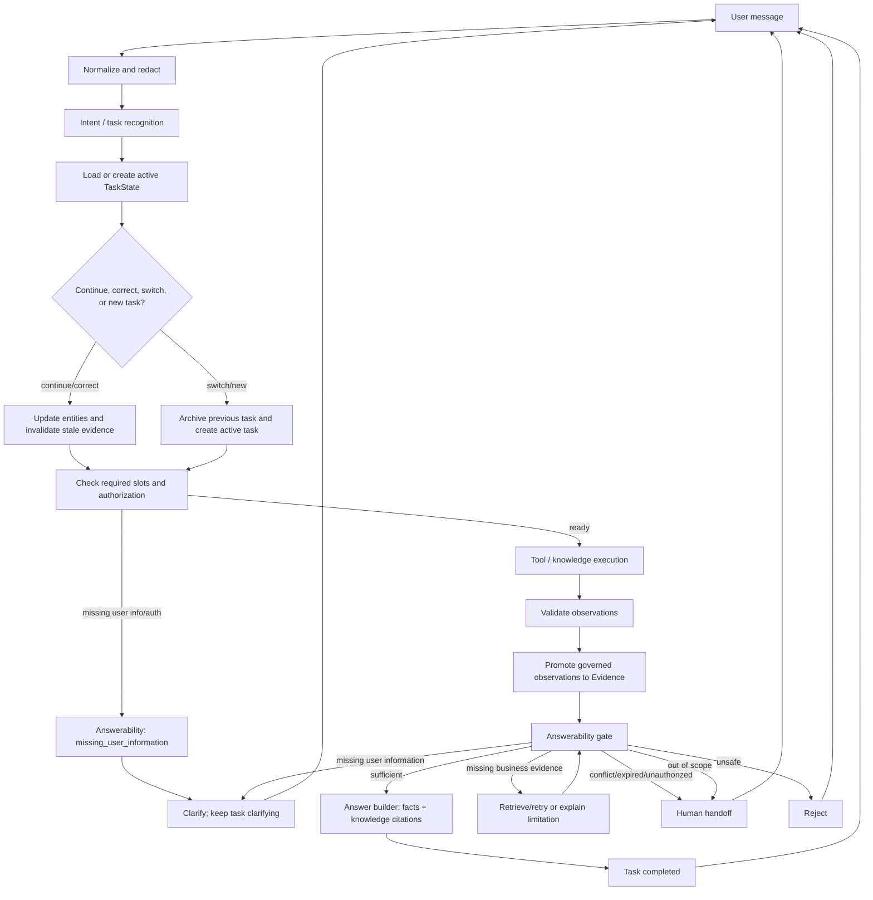

# Historical Architecture Design — V2 Task State + Answerability

> Historical design note written before implementation. Its proposed Task State and Answerability core was implemented in later phases and the public v1.0 release now has 113 automated tests. For the current architecture, see [v1.0 Architecture Overview](overview-v1.0.md) and the root [PRD](../../PRD.md). This document remains as design-history evidence; its V1.1 counts and future-task plan are not current release requirements.

## 1. Why V2

V1.1 已经能在本地完成受控路由、知识检索、账户/订单工具调用、风险拒答、人工转接和 citations 输出。59 个测试证明了这些路径在固定模拟数据下可以稳定运行。

但 V1.1 的核心状态仍然分散在几个短生命周期对象里：`SessionState.pending_slots` 保存少量待补充字段，`Engine._diagnose()` 的 `observations` 只存在于一次请求，`AgentResponse.status` 用字符串表示结果，`citations` 只在响应层返回。系统可以知道“这次要输出什么”，却不能稳定表达：

- 用户正在完成哪一个任务；
- 这个任务已经确认了哪些实体和事实；
- 哪些信息仍然缺失；
- 某条证据是否属于当前用户、当前版本和当前任务；
- 相关资料是否真的足以结束任务。

V2 的目标不是引入更大的 Agent 框架，而是在现有 deterministic workflow 和受控 Agent loop 上增加两个明确的边界：

1. `TaskState`：记录一个任务从识别、补充、执行到结束的生命周期。
2. `AnswerabilityDecision`：在最终回答前判断证据是否足以支持该任务的目标。

核心判断从 V1.1 的：

> What should I answer?

扩展为：

> What task is the user trying to complete? What is verified? What is missing? Is the evidence sufficient to finish it?

## 2. V1.1 Current State

### 2.1 会话和任务目前如何混在一起

`app/schemas.py` 的 `SessionState` 当前字段为：

- `session_id`：会话身份。
- `user_id`、`authenticated`：模拟登录身份和认证状态。
- `messages`：会话消息历史。
- `pending_slots`：短期澄清或登录续办数据。
- `loop_steps`：最近一次 Agent loop 的步数。
- `traces`：会话级处理记录。

V1.1 中 `pending_slots` 的实际键只有几类：

- `intent`：订单或资格任务等待补充时的意图。
- `query`：登录后继续处理的原问题。
- `clarifications`：unknown 任务连续澄清次数。

V1.1 已经通过 `reset_pending_task_context()` 在任务结束时清理这些短期字段，但它仍然是一个无类型字典，不能表达任务目标、实体、证据或任务关系。

### 2.2 当前调用链

`Engine.handle()` 完成以下工作：

1. 规范化、脱敏并追加用户消息。
2. 用 `pending_slots` 处理“继续查询”和资格板块补充。
3. 调用 `router.route()` 得到 `intent`。
4. 对风险和人工转接直接结束。
5. 对 `rules` 调用 `retriever.search()`；有模型时可能让模型重新分类和生成 grounded answer。
6. 对私有 intent 进入 `_diagnose()`，由确定性 sequence 或 fake/real planner 选择工具。
7. 将工具结果写入局部 `observations`，再由 `render_facts()` 生成事实答案。
8. 将 `docs` 作为 citations 写入 `AgentResponse`。
9. 添加 guardrail 和 metrics trace，并将消息响应保存到 `SessionState.messages`。

`app/runtime/router.py` 的路由是确定性的关键词和正则判断；`app/runtime/tools.py` 负责参数模型、账户归属和事实渲染；`app/rag/retriever.py` 负责词项检索；`app/rag/governance.py` 的 `current()` 负责有效期、审核状态、audience 和 `direct_answer` 判断。

### 2.3 当前缺口

- 没有 `task_id`、任务历史或 active task。
- `intent` 是一次响应的字符串，不是可持续的任务类型。
- `order_id`、board 等实体没有统一的 confirmed/unconfirmed 表示。
- `observations` 在请求结束后没有作为任务对象持久化；只有响应和 trace 间接保留部分信息。
- 没有统一 `Evidence` 信封区分账户事实与知识证据。
- `render_facts()` 能使用已返回的知识 observation，但没有统一判断“相关”是否等于“足够回答”。
- 没有统一冲突、过期、错误 audience、缺少用户信息和工具失败的 answerability contract。
- `AgentResponse.status` 的 `answered`、`clarify`、`need_auth`、`rejected`、`handoff` 既承担任务状态又承担本次响应动作。

## 3. Problem Definition

V2 要解决两个互相依赖的问题。

### 3.1 任务连续性问题

用户不应因为改写一句话、补充订单号或纠正实体而丢失当前任务；系统也不应因为保留旧上下文而把新任务误认为旧任务。

以下行为需要有明确语义：

- “ORD1001”是补充当前订单诊断的缺失槽位。
- “不是这个，我问 ORD1002”是同一任务的实体纠正，应使旧订单证据失效。
- “那基金呢？”是新领域任务，不应继续使用订单状态。
- “我还想问一下……”只表示用户准备开启新任务，旧任务应被结束或归档。
- “继续查询”是登录后的恢复动作，不是新任务。

### 3.2 证据充分性问题

“找到相关资料”不等于“可以完成任务”。

- K003 可以解释“未成交”是一个状态，但不能证明 U1001 的某一笔订单实际为何未成交。
- `get_order_detail` 可以证明订单状态，但不一定能证明业务原因；原因缺失时不能补写资金或价格推断。
- 账户事实必须绑定当前登录用户；公共知识不能代替身份认证。
- 过期、draft、staff-only 或非 direct-answer 记录不能支撑公开回答。
- 两个有效版本互相冲突时，相关性再高也不能直接完成任务。

因此 V2 需要一个在最终回答前运行的 answerability gate，而不是把“检索命中”直接当成 `answered`。

## 4. Product Goals

V2 必须做到：

1. 一个会话有一个明确的 `active_task`，并保留有限的已结束任务摘要。
2. 每条用户消息都被判断为：继续当前任务、纠正当前任务、切换到新任务或主动结束当前任务。
3. clarification counter、missing slots、observations 和 evidence 属于任务，而非永久会话状态。
4. 任务可以表达“缺用户信息”“缺业务证据”“证据冲突”“未授权”“不安全”等不同原因。
5. 最终回答只能使用被验证、未过期、audience 正确且支持当前任务目标的 evidence。
6. 简单公共知识问答继续走 deterministic RAG；只有需要规划的私有任务才进入 Agent loop。
7. 所有新判断都能在离线测试中复现，不依赖真实外部模型或金融系统。
8. V1.1 的路由边界、工具白名单、归属校验、风险拒答、知识治理和 59 个测试继续成立。

V2 不追求：并发任务编排、长期用户记忆、自主交易或多 Agent 协作。

## 5. Task State Model

### 5.1 SessionState 和 TaskState 的边界

`SessionState` 表示会话和安全上下文，建议继续保留：

- `session_id`
- `user_id`
- `authenticated`
- `messages`
- `traces`
- `active_task_id`
- `recent_task_ids`（有界，例如最近 3 个）

`TaskState` 表示一个用户目标的短期生命周期，建议包含：

```text
TaskState
├── task_id
├── task_type
├── domain
├── objective
├── entities
├── required_slots
├── missing_slots
├── confirmed_facts
├── observations
├── evidence
├── answerability
├── status
├── clarification_count
├── parent_task_id / supersedes_task_id
├── completion_reason
├── created_at
└── updated_at
```

一个 session 默认只有一个 active task；可以保留有限的 terminal task 摘要用于“继续刚才的任务”，但不支持多个并行 active task。这样既能支持任务切换，也不会引入大型 workflow engine。

### 5.2 字段定义

| 字段 | 作用 | 写入者 | 读取者 | 层级与持久化 |
|---|---|---|---|---|
| `task_id` | 稳定标识一次用户目标 | Task lifecycle manager | Engine、API、trace、评测 | task；持久化 |
| `task_type` | canonical task 类型，如 `public_knowledge`、`account_query`、`order_diagnosis`、`risk_or_handoff` | Router/Task recognizer | Required evidence、Answerability、Answer builder | task；持久化 |
| `domain` | 开户、账户、资金、交易、风险等业务域 | Router 或模型辅助识别 | Retriever、工具白名单、证据冲突分组 | task；持久化 |
| `objective` | 规范化的用户目标，不是原始句子 | Task recognizer | 任务切换判断、Answerability、审计 | task；持久化摘要 |
| `entities` | `order_id`、board、用户选择等实体，含来源和 confirmed 状态 | Entity extractor、用户纠正、工具验证 | 工具参数、缺槽位判断、证据绑定 | task；持久化 |
| `required_slots` | 该任务完成所需的槽位声明 | canonical task policy | Task lifecycle、Clarifier | task；持久化 |
| `missing_slots` | 当前尚未满足的槽位 | Deterministic validator | Clarify、Answerability | task；持久化 |
| `confirmed_facts` | 已验证的结构化业务事实摘要 | Tool adapter | Answerability、Answer builder | task；持久化，脱敏 |
| `observations` | 原始工具/RAG 执行结果和状态，包含调用名、参数摘要、结果引用、错误码 | Tool/Retrieval executor | Evidence adapter、模型 planner、trace | task；持久化脱敏摘要 |
| `evidence` | 通过验证、可被任务引用的证据对象 | Evidence registry | Answerability、citations、Answer builder | task；持久化 |
| `answerability` | 最近一次充分性判断及缺口 | Answerability evaluator | Engine 分支、API trace、评测 | task；持久化 |
| `status` | 生命周期状态 | Task lifecycle manager | Engine、UI、API、评测 | task；持久化 |
| `clarification_count` | 当前任务的澄清次数 | Task lifecycle manager | 防止重复追问、handoff policy | task；持久化 |
| `parent_task_id` / `supersedes_task_id` | 记录任务纠正或切换关系 | Task manager | 审计、恢复和分析 | task；可选持久化 |
| `completion_reason` | `answered`、`user_switched`、`unauthorized` 等结束原因 | Lifecycle manager | trace、工单摘要、评测 | task；持久化 |
| `created_at` / `updated_at` | 生命周期和超时判断 | Task manager | Store、观测、清理 | task；持久化 |

`messages`、用户身份、认证状态和 trace 是 session-level；clarification counter、pending slots、observations 和 evidence 不能继续作为 session 的无界杂项。

### 5.3 实体结构

实体不应只是 `dict[str, Any]` 中的裸字符串。建议最小结构为：

```text
EntityValue
├── name
├── value
├── source: user | tool | model
├── confirmed: bool
└── confidence: optional
```

`order_id` 由用户提供且通过订单号格式校验后可以 `confirmed=true`，但仍需工具做账户归属验证。模型提出的用户没有说过的订单号只能是候选值，不能直接作为工具参数。用户说“另一个订单”时，新的实体替换旧实体，并使依赖旧订单的 evidence 失效。

### 5.4 一个 session 是否允许多个 task

建议“一 active + 有界历史”：

- 同一时刻只有一个 `active_task_id`。
- 已完成、拒答、转人工或放弃的任务保留最近 3 个摘要。
- 不支持两个任务并行执行，也不在一个回答中混合两个任务的 evidence。
- 用户明确回到“刚才那个订单”时，可以恢复最近任务，但恢复前必须重新检查其 evidence 是否仍有效。

这满足连续对话，又避免把全部聊天历史都当成当前任务上下文。

## 6. Task Lifecycle

### 6.1 推荐状态集合

状态尽量少，建议为：

- `new`：已创建但尚未完成任务识别。
- `clarifying`：任务可识别，但缺少用户信息、认证或实体槽位。
- `executing`：正在调用工具或知识检索。
- `completed`：Answerability 为 `sufficient`，回答已生成并交付。
- `handoff`：无法安全自动完成，已转人工/本地工单。
- `rejected`：风险、不允许或越权请求被拒绝。
- `abandoned`：用户切换任务、主动结束或会话超时，未完成当前目标。

`answerable` 不必成为长期状态；它是 AnswerabilityDecision 的 `sufficient` 结果，经过 answer builder 后转为 `completed`。同理，`need_auth` 是 `clarifying` 状态下的 `missing_user_information` 原因，而不是另一套生命周期。

### 6.2 生命周期

```text
new
 ├─ 任务明确且无缺口 ─> executing
 ├─ 缺少用户信息/认证 ─> clarifying
 ├─ 风险或越权 ─> rejected
 └─ 用户换题/结束 ─> abandoned

clarifying ──补齐槽位/认证──> executing
executing ──证据充分──> completed
executing ──需要用户补充──> clarifying
executing ──无法安全完成──> handoff
executing ──风险规则触发──> rejected
```

### 6.3 继续、纠正、切换

每条新消息先经过一个轻量的 task relation 判断：

1. **继续当前任务**：消息填补 `missing_slots`，例如只输入 `ORD1001` 或“创业板”。保留 task_id 和已验证 evidence。
2. **纠正当前任务**：出现“不是这个”“我问的是另一个订单”等纠正语义。保留 task_type，但替换实体；清除依赖旧实体的 evidence 和 answerability，重新进入 `clarifying` 或 `executing`。
3. **结束并新建任务**：出现明确领域切换，如“那基金呢？”或“我还想问开户材料”。当前 task 标为 `abandoned`（如果已有完整回答则保持 `completed`），创建新的 active task，不继承旧 task 的 evidence。
4. **恢复历史任务**：用户说“继续刚才的订单”。只从最近任务摘要恢复目标和实体，重新验证时效、身份和 evidence，不直接复用旧答案。
5. **只说“我还想问一下”**：创建新的 `clarifying` task，询问新目标；旧任务保持 terminal 状态。

### 6.4 clarification counter、pending slot、observations 的归属

- `clarification_count` 属于 `TaskState`，新 task 从 0 开始；达到策略上限后转 `handoff`，不会污染新 task。
- `pending_slots` 在 V2 中应被 `required_slots`、`missing_slots` 和 `continuation_context` 取代。为兼容 V1.1，可以在迁移期保留它作为序列化兼容字段，但不再作为决策真相源。
- `observations` 属于 task。session trace 可以保留审计事件，但不能被当作当前任务 evidence。
- `evidence` 属于 task，并且只允许从当前 task 的 observations 晋升；新 task 不继承旧 evidence。

### 6.5 终态定义

- `completed`：目标对应的 required evidence 已满足，安全回答已经交付；若任务只要求拒答，安全拒答也可以是 `rejected` 而不是 completed。
- `abandoned`：用户主动切换、明确结束、会话过期或不再继续，且没有安全完成目标。
- `handoff`：需要人工核查、系统外部操作、工具持续失败、证据冲突或证据不足但不能继续追问。
- `rejected`：投资建议、越权、提示词攻击或其他 policy 明确禁止的请求。

## 7. Answerability Model

### 7.1 AnswerabilityDecision

建议引入统一的、可测试的决策对象：

```text
AnswerabilityDecision
├── status
├── task_id
├── required_supports
├── satisfied_supports
├── missing_supports
├── evidence_ids
├── next_action
├── reason_code
└── evaluated_at
```

推荐 `status` 集合：

- `sufficient`：当前 evidence 覆盖任务目标，可以回答。
- `missing_user_information`：缺少订单号、板块、认证或用户明确目标等输入。
- `missing_business_evidence`：用户信息足够，但工具/知识还没有提供必要事实。
- `conflicting_evidence`：同一事实键或同一知识标题存在无法安全合并的冲突。
- `expired_or_unusable_evidence`：证据过期、draft、inactive、错误 audience 或 `direct_answer=false`。
- `unauthorized`：未登录、资源不属于当前用户或 audience 不允许当前调用者。
- `unsafe`：请求触发风险规则或输出安全检查。
- `out_of_scope`：当前项目没有相应工具、知识或受支持的业务范围。

`tool_failure` 可以作为 `reason_code`，通常映射为 `missing_business_evidence` 后转 `handoff`，不必扩充长期状态枚举。

`next_action` 建议使用有限集合：`answer`、`clarify`、`retrieve`、`authenticate`、`handoff`、`reject`。

### 7.2 Answerability 发生在哪里

Answerability 不是只放在 Retriever 后，也不是只放在最终文本生成后，而是分两层：

1. **前置槽位检查**：任务识别后，检查 required slots、认证和实体格式。缺失时直接产生 `missing_user_information`，不调用不必要工具。
2. **最终证据门**：工具和知识执行后，验证 observations 是否晋升为足够的 evidence；在 `render_facts()`/Answer Builder 生成最终响应前必须通过。

因此执行顺序建议为：

```text
Task recognition
→ required slot / authorization precheck
→ tool & retrieval execution
→ observation validation
→ evidence registry
→ AnswerabilityDecision
→ answer / clarify / retrieve / reject / handoff
```

### 7.3 什么叫证据充分

证据充分不是“检索结果非空”，而是满足一个任务的 coverage contract：

1. **目标覆盖**：evidence 的 `supports` 至少覆盖 objective 所需的关键问题。
2. **实体绑定**：账户、订单、资金和持仓事实绑定当前 session user；公共知识不冒充个人事实。
3. **时效和治理**：知识在 `as_of` 有效、状态已发布、audience 合法、允许 direct answer。
4. **来源可信**：业务事实来自受控工具；知识事实来自治理后的 retriever；模型文本不能单独成为事实证据。
5. **无未解决冲突**：同一 conflict key 没有不同有效值，或存在明确优先级并已验证。
6. **回答范围受控**：最终 answer 中的每个确定性事实都能链接到 evidence；无法支持的部分必须标为未知或转人工。

相关性分数只能帮助排序，不能单独让任务变为 `sufficient`。

### 7.4 部分回答

如果 evidence 只覆盖目标的一部分，系统可以输出明确的部分回答，但 task 不应直接标为 `completed`，除非产品策略明确允许“部分完成”。推荐：

- 先回答已验证部分；
- 明确列出未验证部分；
- 将 `next_action` 设为 `clarify`、`retrieve` 或 `handoff`；
- 不用知识常识填充缺失的账户或交易事实。

### 7.5 冲突、过期和错误 audience

- 两个活动知识版本对同一标题冲突：`conflicting_evidence`，停止确定性回答并转人工/知识治理。
- 只有过期或 draft 记录：`expired_or_unusable_evidence`，可以说明当前没有可用依据，但不能作为公开事实引用。
- staff-only 记录被普通 API 或 public retriever 看到：先按治理过滤；若已进入 observation，不能晋升 evidence，并记录 `unauthorized`。
- 工具事实与知识规则冲突：当前用户的受控业务事实优先用于个人状态；规则解释必须标明版本和范围；无法解释的冲突进入 `conflicting_evidence`，不能让模型自行选择。

## 8. Deterministic vs Model-Assisted Decision Boundary

### 8.1 Deterministic Layer

以下决策必须由代码完成：

- risk、投资建议、越权和敏感输入拦截；
- task required slots 是否齐全；
- 订单号/板块等实体格式校验；
- session 认证和订单/账户归属；
- 工具白名单、参数 Schema、循环预算和失败码；
- `current()` 的有效期、review status、audience、direct answer；
- evidence 是否来自当前 task、是否已验证、是否覆盖 required support；
- 证据冲突检测和版本治理；
- citations 只能来自实际参与回答的 evidence；
- 任务状态迁移、clarification 上限、handoff/reject 分支；
- unsafe output 检查和不允许的事实编造。

### 8.2 Model-Assisted Layer

模型可以辅助：

- 将自然语言归一为 task type 和 domain；
- 识别用户是在继续、纠正还是切换任务；
- 解析自然语言实体和指代，如“那笔”“另一个”；
- 判断两段证据是否语义上支持同一个自然语言目标；
- 生成澄清问题和最终措辞；
- 从已验证 evidence 中选择表达顺序。

模型不能决定：

- 用户是否有权限；
- 某个订单是否属于当前用户；
- 知识是否过期或可公开；
- 没有工具事实时是否可以声称账户状态；
- 是否绕过 required evidence 或安全策略。

当模型置信度低、无法解析实体或提出未经用户提供的资源标识时，回到 deterministic clarify/handoff，而不是猜测。

## 9. Evidence Model

### 9.1 统一 envelope

业务事实和知识证据可以共享一个 envelope，但 `kind` 和验证规则必须区分：

```text
Evidence
├── evidence_id
├── kind: business_fact | knowledge
├── source: tool | retriever | governance
├── source_id
├── version
├── valid_from
├── valid_to
├── audience
├── scope
├── content
├── verified
├── supports
├── entity_binding
└── conflict_key
```

只保留对 Task State 和 Answerability 有作用的字段；检索排序分数可以作为观测字段，不能取代 `supports`。

### 9.2 两类 evidence 的边界

**业务事实**（`get_account`、`get_order_detail`、`get_funds` 等）：

- `kind=business_fact`；
- `source=tool`；
- `verified` 由参数校验、认证和归属检查共同决定；
- `entity_binding` 至少包含当前 user 或订单实体；
- 通常是当前状态事实，不能脱离有效时间和数据源描述为长期规则。

**知识证据**（`search_knowledge`）：

- `kind=knowledge`；
- `source=retriever/governance`；
- 必须经过 `current(record, as_of, audience)`；
- `version`、有效期、audience 和 scope 是回答依据的一部分；
- 可以解释业务概念和办理规则，不能替代用户的账户/订单事实。

`search_knowledge observation` 只有在治理通过并且 `supports` 当前任务目标时，才能写入 `TaskState.evidence`。原始 observation 可以保留错误码和结果引用，但不能直接当回答依据。

### 9.3 Evidence registry

V2 可在 runtime 中增加轻量 registry，而不是数据库或向量平台：

1. 工具/RAG 返回 observation。
2. adapter 校验结构、来源、归属和有效期。
3. adapter 生成 Evidence 或拒绝晋升并返回 reason code。
4. TaskState 保存 evidence IDs 和摘要。
5. Answerability 根据 required supports 计算覆盖。
6. Answer Builder 只读取通过 gate 的 evidence，并把 evidence IDs 映射到 citations。

## 10. Canonical Tasks

### 10.1 公共知识解释

```text
User Goal
  解释一个公开业务概念或办理规则
Required Information
  明确的问题/概念；通常不需要登录
Required Tools
  search_knowledge（确定性规则问题优先）
Required Evidence
  至少一条当前 public、已发布、direct_answer 的知识记录，且 supports 目标概念
Answerability
  sufficient → 回答并引用版本；无命中 → missing_business_evidence
Success Condition
  answer 只包含知识证据支持的解释，任务 completed
Failure / Handoff
  无答案、过期、冲突或范围不明 → 澄清、说明无依据或转人工
```

### 10.2 本人账户查询

```text
User Goal
  查询本人开户进度、账户状态、资金、风险或持仓
Required Information
  明确查询目标；已认证的模拟账户身份
Required Tools
  get_account / get_funds / get_risk / get_holdings
Required Evidence
  当前 session 用户绑定的业务事实；公共知识只能作为补充解释
Answerability
  missing_user_information（未登录）或 sufficient（有归属事实）
Success Condition
  返回结构化账户事实，明确 simulation 和数据范围
Failure / Handoff
  未认证 → authenticate；工具失败/数据缺失 → handoff；越权 → unauthorized
```

### 10.3 订单异常诊断

```text
User Goal
  解释某个订单的状态和可验证原因
Required Information
  order_id、当前用户认证
Required Tools
  get_order_detail；必要时 search_knowledge 解释状态定义或下一步
Required Evidence
  owner-bound order fact；若回答规则原因，还需有效 knowledge evidence
Answerability
  order_id 缺失 → missing_user_information；订单事实有效且覆盖目标 → sufficient
Success Condition
  订单状态、工具返回原因和下一步均可追溯；知识依据不覆盖订单事实
Failure / Handoff
  不存在、非本人、原因缺失、冲突或工具失败 → unauthorized、missing_business_evidence 或 handoff
```

### 10.4 风险拒答与人工转接

```text
User Goal
  请求投资推荐、执行交易，或明确要求人工帮助
Required Information
  风险请求不需要继续收集；人工转接需要问题摘要
Required Tools
  风险规则/本地工单工具；不调用真实交易服务
Required Evidence
  风险拒答依赖确定性 policy；转人工依赖脱敏摘要和 trace
Answerability
  unsafe → reject；明确 handoff 或无法安全完成 → handoff
Success Condition
  拒答不泄露建议；工单明确 local-only 和原因
Failure / Handoff
  不把模型生成内容当作许可，不把本地工单表述为真实坐席已接单
```

## 11. End-to-End Workflow



Task State 和 Answerability 的关系是：TaskState 保存目标、缺口、观察和证据；Answerability 根据该 task 的 required supports 对证据做一次可审计判断；判断结果决定下一条动作并推动 task 状态迁移。

## 12. Current Code Mapping

### 12.1 `app/schemas.py`

未来增加 `TaskState`、`Evidence`、`AnswerabilityDecision` 及有限枚举，并在 `SessionState` 增加 `active_task_id` 与有界历史引用。V1.1 的 `pending_slots` 可以保留一段迁移期，但新逻辑不应把它作为唯一状态来源。

现有 `AgentResponse` 的 `status`、`citations`、`observations` 可以继续向后兼容；新字段应以可选方式增加，不改变已有 API response 的含义。

### 12.2 `app/runtime/router.py`

保留当前确定性关键词、风险优先级、公共定义与订单边界。增加一个轻量 adapter，把 `route()` 的 intent、board、order_id 转换为 `TaskCandidate`，不在 Router 内实现完整任务状态机。

模型辅助的 task relation（继续/纠正/切换）应在 Router 结果之后，由 Task lifecycle layer 判断；不要让模型直接覆盖认证和订单归属规则。

### 12.3 `app/runtime/engine.py`

`Engine.handle()` 是最主要的接入点：

1. 在规范化后加载或创建 active TaskState。
2. 先判定消息与当前 task 的关系。
3. 运行 required slot/authorization precheck。
4. 在 `_diagnose()` 和 RAG 路径中把 observation 写入 task。
5. 在 `render_facts()` 或新的 Answer Builder 前调用 Answerability evaluator。
6. 根据 decision 选择 answer、clarify、retrieve、reject 或 handoff。
7. 任务完成后更新状态；保留 V1.1 的 `pending_slots` 兼容清理。

不应继续让 `Engine.handle()` 同时拥有所有状态迁移、证据校验和渲染细节；允许加一层小型 `TaskManager` 和 `AnswerabilityEvaluator`，但不重写整个 Engine。

### 12.4 `app/runtime/tools.py`

保留工具白名单、Pydantic 参数校验、账户归属检查和受控事实模板。增加 observation adapter，把 `execute()` 的结果转换为业务事实 Evidence；`render_facts()` 只接收通过 answerability gate 的 evidence，或由新的 Answer Builder统一消费。

### 12.5 `app/rag/retriever.py` 与 `app/rag/governance.py`

保留词项检索、alias、top-k 和冲突保护。Retriever 继续负责“找候选记录”，governance 继续负责“记录是否可用”。新增的是向 Evidence 的转换和 `supports` 标注，不在本阶段引入向量数据库或 reranker。

`as_of` 和 `audience` 应由调用方显式传递，避免 API、Agent 和检索使用不同的时间/受众口径。

### 12.6 `app/api.py` 与持久化

`/api/sessions/{sid}/messages` 继续把响应和 trace 保存到 Store；未来需要把 active task 和有界 task 摘要持久化，不能只依赖进程内对象。`/api/knowledge` 已复用 public governance 过滤，保持接口结构不变；可在未来返回治理后的 metadata，但不应暴露 staff/draft 记录。

`app/storage.py` 不在本阶段改动，但进入 Coding 阶段时应作为 TaskState 持久化的配套文件评估。

### 12.7 `app/runtime/policy.py`

保留风险词、脱敏、unsafe output 和 evidence-supported 检查。Answerability 的 `unsafe` 分支应复用 policy，而不是在新 evaluator 中复制一套风险规则。

## 13. Test Strategy

现有 59 个测试应保持原样，作为 V1.1 compatibility suite。V2 新增测试不应降低既有断言。

建议新增测试类别：

1. **Task creation**：首条消息创建 task，task_id 稳定，clarification 从 0 开始。
2. **Continuation**：订单缺号后输入 `ORD1001`，继续原 task 而不是新 task。
3. **Entity correction**：`ORD1001` 改为 `ORD1002` 后旧订单 evidence 被作废，不能混用。
4. **Task switch**：订单任务后问“那基金呢”，创建新 task，不携带订单 citations。
5. **Task resume**：恢复“刚才那个订单”时重新检查认证、归属和 evidence 时效。
6. **Clarification lifecycle**：成功回答、拒答、handoff 和切换都不会污染新任务计数。
7. **Evidence missing**：有 order_id 但工具没有原因时不能声称资金或价格原因。
8. **Evidence irrelevant**：命中开户材料不能支撑账户余额或订单状态。
9. **Evidence conflict**：同标题不同活动版本阻止确定性回答并进入 handoff。
10. **Expired/audience**：过期、draft、staff-only 记录不能晋升 public evidence。
11. **Unauthorized**：他人订单工具结果不能成为 evidence。
12. **Answerable**：required supports 全部满足时返回 answer 和精确 citations。
13. **Partial answer**：只返回已验证部分并明确下一步，不把 task 错标为 completed。
14. **Model boundary**：模型提出未由用户提供的 order_id 时被 deterministic 层拒绝。
15. **Persistence**：Store 重建后 active task、状态和脱敏 evidence 摘要保持一致。

每类测试都应使用固定本地 fixture、fake planner 或 monkeypatch，不调用真实外部模型。

## 14. V2 Must / Should / Won't

### Must

- 一个 active TaskState 和有界任务历史。
- typed required slots、entities、observations、evidence 和 answerability decision。
- 明确的继续/纠正/切换规则。
- owner-bound business fact 与 governed knowledge evidence 的统一追踪格式。
- 最终回答前的 deterministic answerability gate。
- 过期、audience、冲突、未授权、unsafe 和缺证据的可测试分支。
- 与 V1.1 59 个测试兼容，所有新增行为可离线验证。

### Should

- 模型辅助自然语言 task relation 和实体指代解析，并有 deterministic fallback。
- 有界任务历史和安全恢复。
- Answerability trace 中记录 required/satisfied/missing supports。
- 对部分回答、工具失败和证据冲突提供一致的用户措辞。
- 继续使用现有 SQLite，先保存脱敏摘要，不引入新数据库。

### Won't（本阶段不做）

- Multi-Agent、LangGraph 或大型 workflow platform。
- Vector DB、Reranker、Graph DB；当前词项检索和 14 条演示知识不足以证明需要它们。
- MCP ecosystem、Agent marketplace 或自主工具发现。
- Long-term memory、跨会话用户画像和个性化推荐。
- 多渠道客服、真实坐席系统、真实券商账户、行情、交易执行和银行系统。
- 让模型决定权限、证据有效性、订单归属或金融操作。

## 15. Overengineering Risks

以下设计看起来高级，但当前项目不应该做：

- **Multi-Agent**：当前主要问题是任务状态和证据门，不是角色数量不足；多个 Agent 会增加状态和证据汇聚风险。
- **LangGraph/复杂事件驱动**：当前单进程、短任务、低并发；先用有界 TaskManager 表达生命周期。
- **Vector database/Reranker**：知识库只有演示规模，现有词项检索已能表达测试目标；先补 answerability 数据，而不是换检索基础设施。
- **Graph database**：没有需要多跳关系查询的真实数据源。
- **复杂 long-term memory**：账户事实和订单事实必须实时、受控、按用户绑定，不应从长期自然语言记忆恢复。
- **Autonomous planning**：当前工具集合少且有明确白名单，增加自主规划不会解决证据不足。
- **MCP ecosystem/marketplace**：没有外部系统接入需求，也没有权限治理基础。
- **Microservices**：本项目是本地演示服务，拆服务会增加部署和一致性成本。

## 16. Implementation Plan

以下是下一阶段的实际 Coding Tasks；本阶段只设计，不实施。

### TASK-201：Task State schema

- **Objective**：建立 `TaskState`、实体、任务状态和 session active task 引用。
- **Files likely affected**：`app/schemas.py`、可能新增 `app/runtime/task_state.py`。
- **What changes**：增加 typed model、有限 enum、版本兼容字段；把 `pending_slots` 标为迁移兼容。
- **What must not change**：现有 `SessionState` 身份字段、V1.1 API response 和 59 个测试行为。
- **Tests required**：schema validation、状态枚举、序列化/反序列化、未知字段拒绝。
- **Acceptance criteria**：可以创建一个新 task，并在 Store/API round-trip 中保留 active task 摘要。

### TASK-202：Task lifecycle manager

- **Objective**：集中处理创建、继续、纠正、切换、完成、放弃、handoff 和 reject。
- **Files likely affected**：新增 `app/runtime/task_manager.py`、`app/runtime/engine.py`。
- **What changes**：实现一个 active task、有限历史、transition guard、clarification_count 和实体替换时的 evidence invalidation。
- **What must not change**：不并行执行多个 task，不改变现有 router 的安全优先级。
- **Tests required**：continuation、entity correction、task switch、resume、clarification reset。
- **Acceptance criteria**：同一任务补槽位不会丢失 task_id；切换任务不会携带旧 evidence。

### TASK-203：Task relation and entity adapter

- **Objective**：把 Router/可选模型输出转换为继续、纠正、切换或新建 task 的关系。
- **Files likely affected**：`app/runtime/router.py`、新增 `app/runtime/task_relation.py`、`app/runtime/engine.py`。
- **What changes**：复用公共定义/订单边界和 order_id/board 解析；模型只提供候选，deterministic validator 最终确认。
- **What must not change**：不让模型注入未经用户提供的订单号，不扩大工具权限。
- **Tests required**：中文改写、`不是这个`、`另一个订单`、`那基金呢`、登录后继续查询。
- **Acceptance criteria**：任务关系在固定输入下稳定可判定，低置信度安全进入 clarification。

### TASK-204：Evidence contract and registry

- **Objective**：统一业务事实和知识证据的 envelope，并保留来源、版本、有效期、audience、绑定和 supports。
- **Files likely affected**：`app/schemas.py`、新增 `app/runtime/evidence.py`、`app/runtime/tools.py`、`app/rag/retriever.py`。
- **What changes**：将工具/RAG observation 转换为可验证 Evidence；去重、失效和冲突 key 由 registry 管理。
- **What must not change**：不改变账户归属校验、知识治理函数和既有 citations 契约。
- **Tests required**：business fact、knowledge evidence、expired/audience、owner binding、conflict。
- **Acceptance criteria**：每个最终 citation 都可追溯到当前 task 的实际 observation。

### TASK-205：Answerability contract

- **Objective**：建立可测试的 `AnswerabilityDecision` 和 required support coverage。
- **Files likely affected**：新增 `app/runtime/answerability.py`、`app/schemas.py`、`app/runtime/policy.py`。
- **What changes**：实现 sufficient、missing user info、missing business evidence、conflict、expired、unauthorized、unsafe、out-of-scope 的 deterministic 判定。
- **What must not change**：不把模型判断当作权限或证据有效性的最终来源。
- **Tests required**：每种 decision、部分回答、错误 audience、无关证据和工具失败。
- **Acceptance criteria**：同一 TaskState + Evidence 输入得到稳定 decision 和明确 next_action。

### TASK-206：Engine integration and answer builder

- **Objective**：把 TaskState、Evidence 和 Answerability 接入 `Engine.handle()` / `_diagnose()`。
- **Files likely affected**：`app/runtime/engine.py`、`app/runtime/tools.py`、可能新增 `app/runtime/answer_builder.py`。
- **What changes**：在工具/RAG 后登记 evidence，在最终输出前过 gate，统一 answer/citations/trace。
- **What must not change**：简单 FAQ 仍走 deterministic RAG；私有事实仍由工具生成；不重写 Agent loop。
- **Tests required**：59 个 V1.1 测试、四个回归测试、canonical task end-to-end。
- **Acceptance criteria**：旧套件保持通过，新 task/evidence tests 全部通过。

### TASK-207：Persistence and API compatibility

- **Objective**：持久化 active task 和有界 task 摘要，保持现有 API 响应兼容。
- **Files likely affected**：`app/storage.py`、`app/api.py`、`app/schemas.py`。
- **What changes**：Store 保存脱敏 TaskState/evidence 摘要；API trace 和 message response 增加可选 task/answerability metadata。
- **What must not change**：不暴露 staff/draft 知识，不存真实 secret，不修改模拟账户模型。
- **Tests required**：新 Store instance 恢复 task、logout/switch 清理私有 task、API response compatibility。
- **Acceptance criteria**：进程内外恢复 active task 的关键状态，现有前端仍可工作。

### TASK-208：V2 offline evaluation and regression pack

- **Objective**：把 task continuity 和 evidence sufficiency 纳入离线评测。
- **Files likely affected**：`tests/`、`eval/main.json` 或新增受控 fixture、`eval/run.py`、审计文档。
- **What changes**：加入 canonical task cases、answerability labels、conflict/expired/unauthorized bad cases。
- **What must not change**：不调用真实模型，不把历史 live report 当作本轮结果。
- **Tests required**：任务生命周期、证据覆盖、状态迁移和 golden decision。
- **Acceptance criteria**：评测能区分“相关但不足”和“足以回答”，并输出可复查的失败样本。

## 17. Open Questions

1. 任务切换后旧任务是否只保留摘要，还是允许用户在同一 session 恢复最近一个未完成任务？
2. `clarification_count` 的上限是否按 task type 区分，还是统一策略？
3. 订单事实与知识规则冲突时，哪些字段有明确的业务优先级，哪些必须人工确认？
4. 生产场景的 `as_of` 应取请求时间、业务日还是工具数据时间戳？
5. staff audience 是否未来需要认证的内部 API，还是永远不在当前产品范围内？
6. 部分回答是否算一次 completed，还是必须等 required supports 全部满足？本设计默认后者。
7. 模型辅助 task relation 的最低置信度和回退文案如何通过离线数据集确定？
8. TaskState 和 evidence 的脱敏、保留时长是否需要独立的隐私策略？
9. knowledge `supports` 是由内容标签维护，还是先由有限的 canonical task policy 映射？V2 初期建议采用后者。
10. 真实外部工具接入前，是否需要把工具错误分级为可重试、需人工和不可恢复？

本阶段只完成架构设计和实施计划，没有修改生产代码、测试、配置或依赖。
