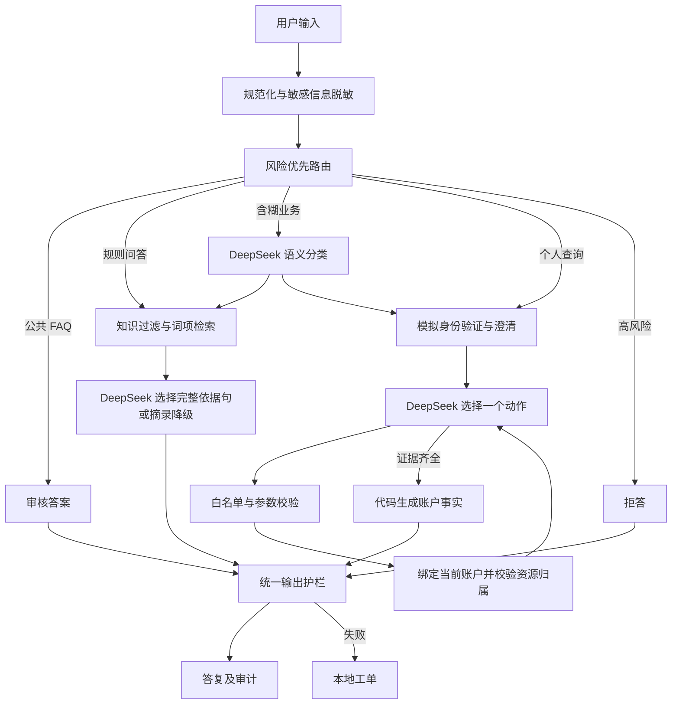

# Historical Technical Trade-off Note

> This note records pre-v1.0 implementation decisions and measured details such as model-loop limits. It is retained as engineering history, not the current product overview. See [v1.0 Architecture Overview](architecture/overview-v1.0.md) and the root [PRD](../PRD.md) for current positioning, Task State, Evidence, and Answerability.

## 1. 本次实际架构

公共材料/定义类问题优先保持公开规则链路，避免“可用和可取有什么区别”被模型误判成个人数据查询。其他不明确输入先做语义路由，再决定是否检索。检索到同主题材料不能证明用户只想问知识。

## 2. DeepSeek 实际做了什么

- 非明确规则入口的语义意图识别。
- 私有查询中的逐步行动选择：工具、继续、结束或人工协同。
- 非固定 FAQ 的完整依据句选择；程序验证整句支持，不开放自由规则改写。

模型调用使用 Pydantic Schema，动作和意图为枚举。记录请求模型名、服务商返回模型名、耗时、重试次数和真实 token 用量。此次请求 `deepseek-chat`，实测响应模型字段为 `deepseek-flash`；两者均保留，不擅自解释服务商的别名映射。

模型规划时不输出/不展示隐含思维过程。界面显示的是动作、工具名和结果等可审计事实。

## 3. 模型无权决定的事情

账户身份绑定、订单归属、工具白名单、参数 Schema、风险规则、规则有效期、是否有必要证据，都由代码判断。模型给出的账户标识无法覆盖会话身份。模型请求的订单号必须与当前用户输入中的订单号一致。读取失败或越权结果不会包含资源详情。

金融账户事实最终从工具观察值进行确定性表达，不直接采信模型自由编造的“订单已成交”或“符合开通条件”。资格核对使用专门标注的测试规则，最终结论仅针对这些测试校验项。

## 4. 受控 Loop 的停止条件

实际线上请求路径在 Engine 中执行：最多 6 个模型动作；重复工具及参数立即终止；不允许的工具、参数或资源立即终止；下一步前检查 75 秒总预算和 10000 token 预算。单次模型请求超时 18 秒，最多重试 1 次，因此总时间预算是调用间检查，正在进行的单次请求可能超出剩余总预算。不是精确实时抢占。

模型如果没有拿到必需工具证据就要求回答，会转入本地工单。无模型时使用相同执行器的固定工具序列，不能将其称为模型自主规划。

`runtime/loop.py` 同时保留可独立测试的通用 Loop 示例；真实业务闭环由 Engine 驱动，不能把仅在单元测试中的通用示例误当线上入口。

## 5. 知识检索的实际边界

先过滤审核状态、受众、有效期与直接回答权限，再按业务关键词选域，以关键词和中文双字词项相关度排序。拒绝同名重叠有效版本。查询同义改写当前是小型显式词表；无 embedding、神经重排或外部向量服务。

这样选择是为了让当前规模下的错误可定位和结果可复现。扩展到真实语料时，需要对切分、词法召回、语义向量召回、融合与重排做消融对比，再决定引入哪些组件。不能仅为了架构听起来完整就宣称做过混合语义检索。

## 6. 持久化与界面

会话、脱敏消息和处理记录写入 SQLite；会话读取有效期 24 小时。最多保留 100 条会话消息、1000 个 trace 事件。退出或切换账户清除私有上下文和当前会话工单；同一会话的查询串行处理，避免模型返回顺序串乱。

前端只保存不透明会话 ID，不保存 DeepSeek 密钥。选择账户的功能为明确的模拟登录。服务只绑定本机 127.0.0.1；跨站写请求会被限制。不能暴露到公网供真实客户使用。

## 7. 面试需要掌握的范式

| 概念 | 决策方式 | 在本项目中的位置 |
|---|---|---|
| Chain | 固定步骤顺序执行 | 检索→生成→检查 |
| Workflow | 固定节点与分支条件 | 鉴权、风险拒答、工具失败路径 |
| Router | 将输入分配到适合的链路 | FAQ、规则、个人查询、风险、未知 |
| Agent Loop | 模型根据观察选择下一动作 | 资格与诊断中的逐步工具选择 |
| ReAct | 行动与观察交替，更新后续决策 | 可以作为 Loop 的组织方式，不要求展示思维链 |
| Multi-Agent | 多个有独立职责/决策权的智能体协作 | 当前没有必要独立部署五个智能体 |
| LangChain | 构建 LLM 应用的开发框架 | 与架构范式不同；本项目未引入 |
| LangGraph | 支持状态图编排的开发框架 | 可用于以后重构，不等于 Agent 本身 |

Router 不一定必须由模型完成；工具执行器、检索器、输出检查器也不因为有角色名就自动成为 Agent。判断是否是 Agent 的关键是：模型是否根据目标与观察选择后续动作，以及这些动作是否真正被执行。本项目在限定业务范围内具备这种能力。
